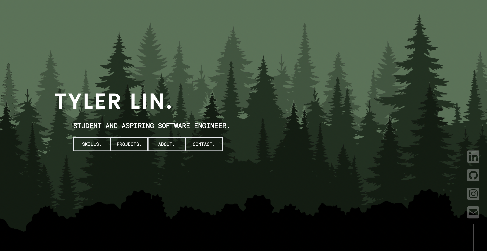

# tylerrlin.github.io

## Introduction

This repository contains the source code for my personal portofolio. Using Typescript and NextJS 13, it is designed to showcase my projects, skills, and experience.

You can visit the live website at [https://tylerrlin.github.io](https://tylerrlin.github.io).

## Features

-   Modular [React](https://reactjs.org/) Components built with [TypeScript](https://www.typescriptlang.org/) using [Tailwind CSS](https://tailwindcss.com/) styling
-   Simple [PocketBase](https://pocketbase.io/) backend to store Contact Form submissions
-   [Framer Motion](https://www.framer.com/motion/) powered animations and gesture responses
-   Responsive design tailored for both mobile/desktop

## Deploy Locally

## Prerequisites

Before running your personal portfolio website locally, ensure you have the following:

-   Node.js installed
-   Git installed

### Steps to Run Locally

#### 1. Clone the Repository

```bash
git clone https://github.com/tylerrlin/tylerrlin.github.io.git
cd tylerrlin.github.io
```

#### 2. Install Dependencies

```bash
npm install
```

#### 3. Start the Development Server

```bash
npm run dev
```

Congratulations! Visit http://localhost:8080 in your browser to view your personal portfolio. To change the port, edit the package.json file.

---

#### Making Changes

Feel free to make changes to the portfolio code. The development server will automatically reload as you save changes.

---
