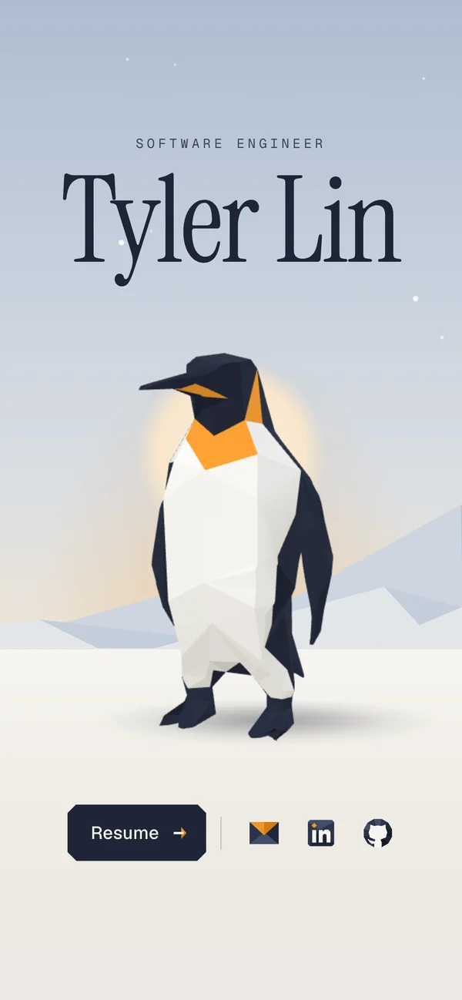

# tylerrlin.github.io

<p align="center">
  
  
</p>
<p align="center">
  
</p>

Visit the live website at [https://tylerrlin.github.io](https://tylerrlin.github.io).

## Stack

- [Vite](https://vite.dev) + React + TypeScript
- [Tailwind CSS v4](https://tailwindcss.com) (via `@tailwindcss/vite`)
- [React Three Fiber](https://r3f.docs.pmnd.rs) + [three.js](https://threejs.org)

## Content

Name, role, email address and social links live in `src/content.ts`.

The resume lives in [`src/resume.ts`](src/resume.ts). Edit the `resume` list
there to change the walk; no other code changes needed. Sections appear in
order, and each entry becomes a stop on the path, followed by one stop per
bullet:

```ts
{
  title: 'Experience',
  entries: [
    {
      org: 'Company',
      role: 'Job title',      // optional
      dates: 'May 2024 – Sep 2024', // optional
      location: 'Boston, MA',       // optional
      bullets: ['One stop per bullet.'], // optional
    },
  ],
},
```

`npm run build` type-checks it, so a missing or misspelled field fails the
build with an error pointing at it.

## Development

```sh
npm install
npm run dev      # dev server
npm run build    # type-check + production build to dist/
npm run preview  # serve the production build locally
```

## Deployment

Pushes to `main` build and deploy to GitHub Pages via `.github/workflows/deploy.yml`.
